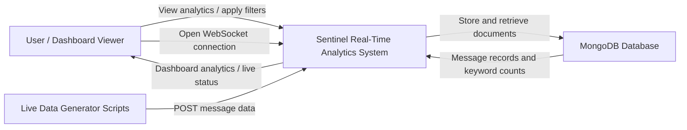
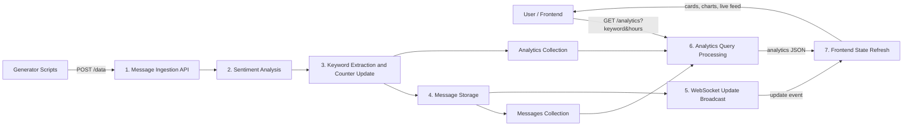
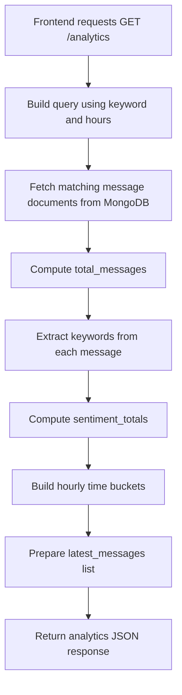
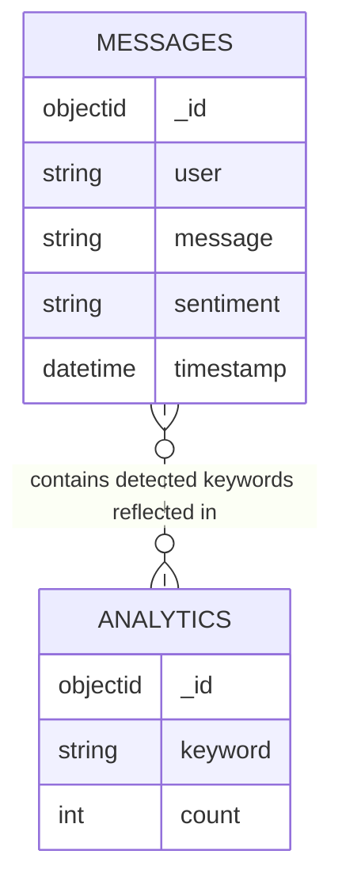
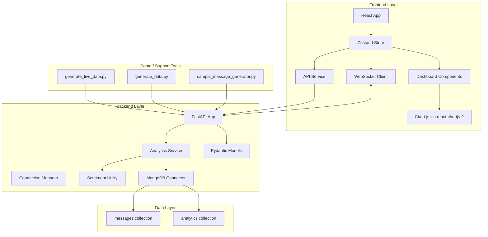
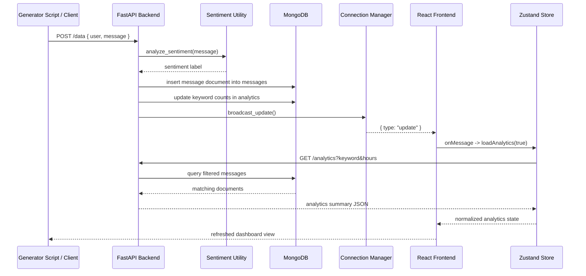
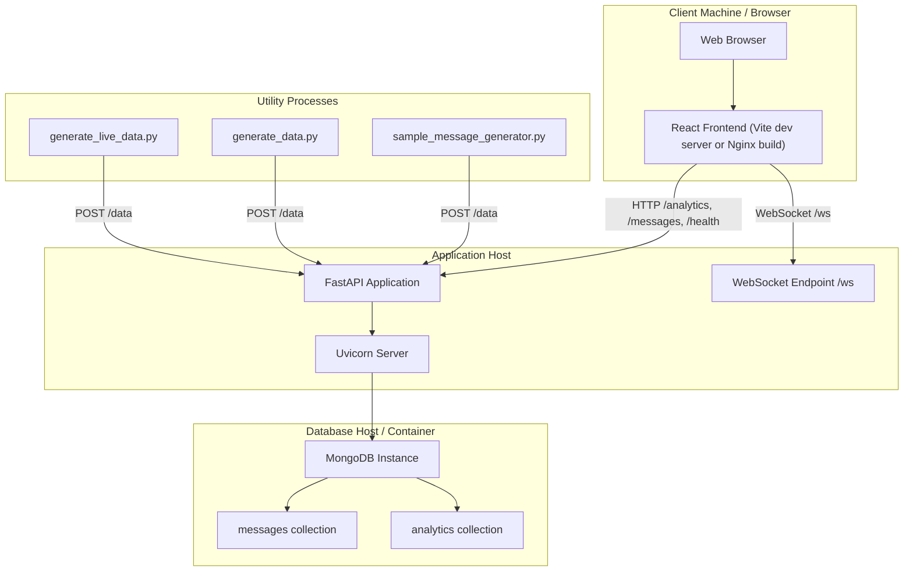

# Sentinel Cloud Native: Actual System Diagrams

This document contains **DFD diagrams, ER diagram, architecture diagram, sequence diagram, and deployment diagram** generated according to the **actual codebase** of:

- [sentinel-backend](C:\Users\r200362\OneDrive - HT Media Ltd\Documents\finalProject\sentinel-backend)
- [frontend](C:\Users\r200362\OneDrive - HT Media Ltd\Documents\finalProject\sentinel\frontend)

The diagrams reflect the current implementation:

1. React + Vite frontend
2. FastAPI backend
3. MongoDB database
4. WebSocket update notifications
5. Zustand state store
6. Chart.js visualization
7. Generator scripts for demo/live data

---

# 1. DFD Level 0

## Description

Level 0 DFD presents the entire Sentinel system as a single process interacting with external entities and the database.

## Explanation

1. The user interacts with the dashboard to view analytics and apply filters.
2. Generator scripts simulate real-time traffic by posting messages to the backend.
3. The Sentinel system processes messages, stores them, retrieves analytics, and sends results back to the dashboard.
4. MongoDB acts as the persistent data store.

---

# 2. DFD Level 1

## Description

Level 1 DFD decomposes the major internal processes present in the implementation.

## Explanation

1. `POST /data` triggers message ingestion.
2. Sentiment is computed using the logic in `utils.py`.
3. Keywords are extracted in `analytics_service.py`.
4. The enriched message is stored in the `messages` collection.
5. Keyword counters are updated in the `analytics` collection.
6. A WebSocket update event is broadcast to connected clients.
7. The frontend then reloads analytics and updates the dashboard.

---

# 3. DFD Level 2 for Analytics Flow

## Description

This diagram expands the analytics retrieval logic implemented in `get_analytics_summary()`.

## Explanation

This reflects the actual backend implementation:

1. Build filtered query.
2. Load matching records.
3. Count documents.
4. Re-extract keywords from message text.
5. Compute sentiment totals.
6. Group records into hour-based time buckets.
7. Extract recent messages.
8. Return a structured summary for the frontend.

---

# 4. ER Diagram

## Description

The current codebase uses MongoDB with two logical collections: `messages` and `analytics`. Since MongoDB is document-oriented, the ER view is conceptual rather than relational.

## Entity Explanation

### `MESSAGES`

Represents individual incoming operational events.

Attributes:

1. `_id`
2. `user`
3. `message`
4. `sentiment`
5. `timestamp`

### `ANALYTICS`

Represents cumulative keyword counters.

Attributes:

1. `_id`
2. `keyword`
3. `count`

## Relationship Explanation

1. A single message may contain multiple tracked keywords.
2. Each matching keyword increments its corresponding analytics document.
3. The relationship is logical and derived through processing, not enforced by foreign keys.

---

# 5. Architecture Diagram

## Description

This diagram shows the high-level software architecture according to the actual repository structure.

## Explanation

1. The React app renders the dashboard.
2. Zustand acts as the state orchestration layer.
3. API and WebSocket services communicate with FastAPI.
4. FastAPI delegates analytics logic to `analytics_service.py`.
5. Sentiment classification is handled by `utils.py`.
6. MongoDB access is handled by `database.py`.
7. Generator scripts simulate event traffic through the same HTTP ingestion endpoint.

---

# 6. Sequence Diagram

## Description

This sequence diagram shows the real-time message ingestion and dashboard refresh workflow.

## Explanation

1. A message is submitted by a script or client.
2. FastAPI classifies sentiment and stores the record.
3. Keyword counters are updated.
4. The backend broadcasts a WebSocket update.
5. The frontend receives the signal and reloads analytics.
6. Zustand normalizes the response and re-renders the dashboard.

---

# 7. Deployment Diagram

## Description

This deployment diagram reflects the actual way the system is structured and run.

## Deployment Notes

1. The frontend can run through the Vite development server or a built Nginx container.
2. The backend runs through Uvicorn serving the FastAPI application.
3. MongoDB may run locally or inside Docker.
4. Generator scripts act as producer processes for demo traffic.

---

# 8. Short Academic Captions

Use the following captions in your final report:

1. **Figure 8.1:** Level 0 DFD of Sentinel Cloud Native Real Time Analytics
2. **Figure 8.2:** Level 1 DFD of Message Processing and Analytics Refresh Flow
3. **Figure 8.3:** Detailed Analytics Retrieval DFD
4. **Figure 8.4:** ER Diagram of MongoDB Collections Used in Sentinel
5. **Figure 8.5:** High-Level Architecture Diagram of Sentinel System
6. **Figure 8.6:** Sequence Diagram of Real-Time Message Ingestion and Dashboard Update
7. **Figure 8.7:** Deployment Diagram of Frontend, Backend, Database, and Generator Components

---

# 9. Accuracy Notes

1. These diagrams are based on the actual codebase and current runtime flow.
2. The frontend uses **Chart.js**, not Recharts.
3. The frontend uses a **custom CSS system**, not TailwindCSS.
4. MongoDB stores `messages` and `analytics` collections.
5. WebSocket is used as a **refresh notification channel**, not as a full event payload stream.
