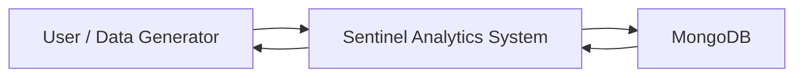
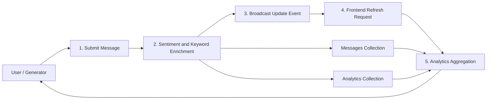
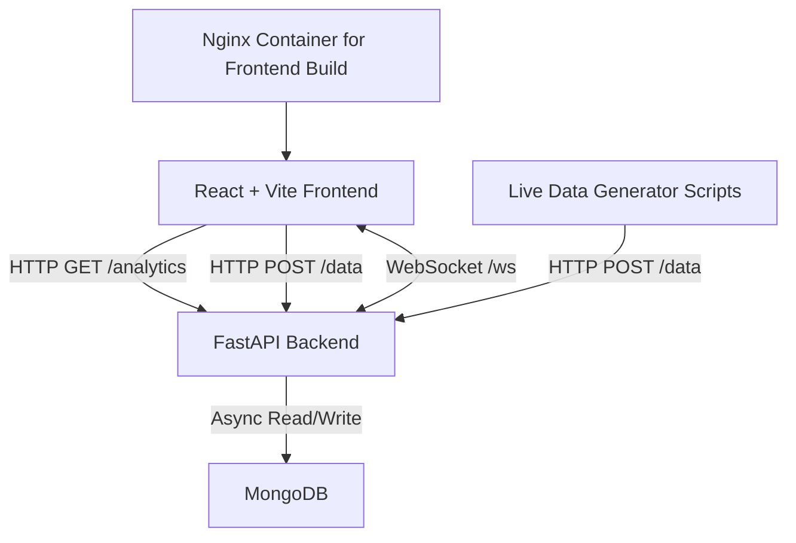

# A MAJOR PROJECT REPORT

## On

**Sentinel Cloud Native: Real Time Data Analytics**

Submitted in partial fulfillment of the requirements for the award of the degree of  
**Master of Computer Applications (MCA)**  
to  
**Bhabha Engineering Research Institute - MCA, Bhopal**  
affiliated to  
**Bhabha University, Bhopal (M.P.)**

### Submitted By

- **Student Name:** `[Enter Student Name]`
- **Enrollment No.:** `[Enter Enrollment Number]`
- **Session:** `[Enter Academic Session]`

### Project Guide / Department

- **Project Guide:** `[Enter Guide Name]`
- **H.O.D.:** `[Enter HOD Name]`
- **Principal:** `[Enter Principal Name]`

---

# CERTIFICATE

This is to certify that **[Student Name]**, student of **MCA IV Semester**, Bhabha Engineering Research Institute - MCA, Bhopal, has successfully completed the major project entitled **"Sentinel Cloud Native: Real Time Data Analytics"** under the guidance and supervision of the undersigned.

The work presented in this project report is submitted in partial fulfillment of the requirements for the award of the degree of **Master of Computer Applications (MCA)** prescribed by **Bhabha University, Bhopal**. To the best of our knowledge, the candidate has carried out the work sincerely, systematically, and with due professional conduct.

The candidate has demonstrated sound understanding of modern full-stack software engineering principles including real-time data streaming, analytics aggregation, web-based visualization, and cloud-native deployment practices. The work is found satisfactory and fit for submission.

We wish the candidate success in future academic and professional endeavors.

**Project Guide**  
`[Guide Name]`

**H.O.D.**  
`[HOD Name]`

**Principal**  
`[Principal Name]`

**Bhabha Engineering Research Institute - MCA, Bhopal**

---

# DECLARATION

I, **[Student Name]**, student of **Master of Computer Applications**, Bhabha Engineering Research Institute - MCA, Bhopal, hereby declare that the work presented in this major project report entitled **"Sentinel Cloud Native: Real Time Data Analytics"** is an authentic record of my own work carried out under the guidance of **[Guide Name]**.

I further declare that:

1. This project has been completed by me during the prescribed academic session for the MCA programme.
2. The work embodied in this report is original and has not been submitted earlier, either in part or in full, to any university or institution for the award of any degree, diploma, or other academic qualification.
3. Due care has been taken to follow engineering ethics, academic integrity, and responsible software development practices.
4. All references used in the report have been duly acknowledged.

**Student Name:** `[Enter Student Name]`  
**Enrollment No.:** `[Enter Enrollment Number]`  
**Date:** `[Enter Date]`  
**Place:** Bhopal

---

# ACKNOWLEDGEMENT

I express my sincere gratitude to **Bhabha Engineering Research Institute - MCA, Bhopal** for providing the academic environment, institutional support, and technical encouragement required for the successful completion of this project.

I am deeply indebted to my **Project Guide, [Guide Name]**, for valuable guidance, timely suggestions, and continuous motivation throughout the planning, development, and documentation of this work. The practical insights shared during the course of the project significantly contributed to the improvement of both the system architecture and the final implementation.

I also extend my heartfelt thanks to the **Head of Department, [HOD Name]**, and the **Principal, [Principal Name]**, for their support and for providing the resources necessary to carry out this work effectively.

I further acknowledge the contribution of faculty members, classmates, and well-wishers whose suggestions, feedback, and encouragement helped me complete this project in a disciplined and confident manner.

Finally, I express my gratitude to my family for their patience, moral support, and encouragement throughout the duration of the project.

**[Student Name]**  
**[Enrollment Number]**

---

# ABSTRACT

The present project, **Sentinel Cloud Native: Real Time Data Analytics**, is a full-stack web-based system developed for monitoring and analyzing continuously arriving textual operational events in real time. The system has been designed as a lightweight cloud-native analytics dashboard capable of ingesting message data, classifying sentiment, extracting predefined operational keywords, aggregating statistics over configurable time windows, and presenting the processed intelligence through an interactive visual dashboard.

The implementation is based on a modern technology stack consisting of a **React + Vite frontend**, a **FastAPI backend**, and a **MongoDB database** accessed asynchronously through **Motor/PyMongo**. For real-time update propagation, the system uses **WebSocket-based event notifications**, enabling the client dashboard to refresh analytics immediately after new data is stored. The dashboard includes analytical summary cards, time-based message volume visualization, keyword trend analysis, sentiment distribution, and a live activity feed of recent enriched messages.

Unlike conventional static dashboards that depend on periodic manual refresh or batch reporting, Sentinel emphasizes near real-time observability. The backend receives messages through an HTTP endpoint, enriches them using rule-assisted sentiment analysis supported by **TextBlob**, stores the records in MongoDB, updates keyword counters, and broadcasts an update event to connected clients. The frontend, managed using **Zustand**, reacts to these update signals and retrieves fresh analytics without interrupting the user experience.

The project demonstrates the practical application of event-driven software design, asynchronous API handling, reactive state management, and operational analytics visualization. It is suitable as an academic model of a real-time monitoring platform and can be extended toward enterprise-grade observability, alerting, anomaly detection, and cloud deployment.

---

# TABLE OF CONTENTS

1. Introduction  
2. System Analysis  
3. Software Requirements  
4. Modules Description  
5. Database Design  
6. Feasibility Study  
7. SDLC  
8. DFD and Architecture  
9. Implementation  
10. Output Screens  
11. Testing  
12. Limitations  
13. Future Enhancements  
14. Conclusion  
15. Bibliography

---

# CHAPTER 1: INTRODUCTION

## 1.1 Introduction

In contemporary digital systems, operational visibility has become a critical requirement. Organizations rely on continuous streams of logs, messages, service alerts, and event data to monitor infrastructure health, application reliability, and business activity. Conventional reporting systems often fail to present such information with sufficient immediacy, resulting in delayed awareness and slower decision-making. This challenge has increased the importance of **real-time analytics systems** capable of ingesting, processing, and visualizing events as they occur.

The project **Sentinel Cloud Native: Real Time Data Analytics** has been developed to address this requirement. It is a browser-based analytics dashboard that captures textual messages, enriches them with sentiment labels and keyword intelligence, stores them in a document-oriented database, and presents the resulting insights through a responsive interface. The project follows a cloud-native design mindset by using loosely coupled layers, HTTP APIs, asynchronous database access, reactive state management, and event-driven update propagation.

The system is intended as a demonstrative operational analytics platform. Incoming messages may represent infrastructure notifications, application telemetry, support incidents, or synthetic stream events. Each message is processed on the server side, assigned a sentiment category such as positive, negative, or neutral, scanned for strategic keywords such as `ai`, `error`, `warning`, `fail`, `success`, `system`, `memory`, and `stable`, and then included in aggregate analytics.

The frontend dashboard provides a unified monitoring experience. It displays:

1. Total processed message count.
2. Sentiment breakdown.
3. Message volume over time.
4. Keyword trend behavior across time buckets.
5. Recent enriched message feed.
6. Real-time connection status and analytics refresh state.

This architecture demonstrates how modern full-stack applications can combine **REST APIs**, **WebSocket events**, **NoSQL persistence**, and **reactive dashboards** to provide operational awareness with low latency.

## 1.2 Existing System

The traditional approach to monitoring event data in many academic prototypes and small software setups is based on one or more of the following:

1. Static log files examined manually.
2. Spreadsheet-based or manually prepared reports.
3. Web pages requiring explicit refresh to show new information.
4. Batch analytics systems that summarize data after fixed intervals.
5. Monitoring tools with limited interactivity or rigid dashboards.

In such systems, data collection and data presentation are usually disconnected. There is minimal enrichment of raw text events, and analytics often remain historical rather than live. Decision-making becomes dependent on delayed summaries instead of continuous visibility.

## 1.3 Problems in Existing System

The above approach introduces several limitations:

1. **No immediate feedback:** New events do not appear instantly on the dashboard.
2. **Weak analytical context:** Raw messages are difficult to interpret without classification or summarization.
3. **Poor discoverability:** Without keyword filtering and aggregation, operational patterns are harder to identify.
4. **Manual monitoring burden:** Human operators must frequently reload pages or inspect logs.
5. **Lack of centralized insight:** Event details, status tracking, and trend analytics remain scattered.
6. **Limited adaptability:** Static systems do not respond well to streaming workloads or cloud-native application behavior.

## 1.4 Proposed System

The proposed system is a **real-time cloud-native analytics dashboard** designed to ingest, enrich, store, aggregate, and visualize message data in a unified workflow.

Its key operational sequence is as follows:

1. A message is submitted to the FastAPI backend through `POST /data`.
2. The backend analyzes message sentiment.
3. The backend extracts configured operational keywords.
4. The enriched message is stored in MongoDB.
5. Keyword counts are updated in the analytics collection.
6. The backend broadcasts a WebSocket update event to connected clients.
7. The React frontend receives the event and triggers a background refresh of analytics.
8. Updated charts, cards, and message feed are rendered immediately.

This design reduces delay, improves observability, and provides a more practical representation of modern dashboard engineering.

## 1.5 Objectives of the Project

The major objectives of the project are:

1. To build a real-time analytics system for continuously arriving message data.
2. To implement a responsive frontend dashboard for operational monitoring.
3. To create a scalable backend API using FastAPI and asynchronous programming.
4. To store semi-structured message data efficiently using MongoDB.
5. To enrich incoming records using sentiment classification and keyword extraction.
6. To enable live update propagation using WebSocket communication.
7. To provide filter-based analytics for keywords and configurable time windows.
8. To demonstrate a cloud-native event-driven monitoring workflow suitable for academic and industrial contexts.

## 1.6 Scope of the Project

The scope of the project includes:

1. Real-time ingestion of text-based events.
2. Sentiment-based categorization of incoming operational messages.
3. Keyword-based analytics on current and recent traffic.
4. Time-series visualization of message volume and keyword activity.
5. Real-time frontend synchronization through WebSocket notifications.
6. A responsive dashboard suitable for desktop and mobile layouts.

The current scope does not include user authentication, multi-tenant isolation, advanced anomaly detection, or production-grade distributed deployment orchestration. However, the architecture is sufficiently modular to support such future expansion.

## 1.7 Advantages of the System

The proposed system offers the following advantages:

1. **Near real-time visibility:** Newly inserted data is reflected quickly on the dashboard.
2. **Cloud-native architecture style:** Loose coupling between UI, API, and database layers.
3. **Reactive user experience:** WebSocket-driven refresh avoids repetitive manual reload.
4. **Actionable analytics:** Sentiment and keyword enrichment convert raw text into readable intelligence.
5. **Flexible filtering:** Users can narrow analysis by keyword and time range.
6. **Operational clarity:** Status indicators show streaming and backend synchronization health.
7. **Extensible design:** Additional modules such as authentication, anomaly detection, or Kubernetes deployment can be added later.

## 1.8 Conceptual Basis

### 1.8.1 Real-Time Analytics

Real-time analytics refers to the processing and presentation of data within a short interval after its generation. In Sentinel, real-time behavior is achieved through immediate ingestion, on-write enrichment, and WebSocket-triggered dashboard refresh.

### 1.8.2 Cloud-Native Architecture

Cloud-native architecture emphasizes modular services, scalable APIs, container-friendly deployment, and stateless interactions. Although the present implementation is academic in scale, it adopts these principles through separate frontend and backend services, environment-based configuration, asynchronous database operations, and Docker-compatible deployment elements.

### 1.8.3 Event-Driven Systems

An event-driven system reacts to state changes or incoming events instead of depending only on periodic polling. Sentinel uses an event-driven update model: when a new message is stored, the backend broadcasts an update event, and the client reacts by reloading analytics.

### 1.8.4 WebSocket Streaming

WebSocket is a bidirectional communication protocol designed for low-latency interactions between clients and servers. In the present system, WebSocket is used as a lightweight notification channel for update events rather than for full raw data transport. This keeps the design simple while still enabling live behavior.

### 1.8.5 Live Dashboard Monitoring

Live dashboard monitoring brings together streaming data, charts, cards, and recent activity panels into a continuously refreshed view. Sentinel implements this through structured charts, animated metric cards, status pills, and a real-time activity feed.

---

# CHAPTER 2: SYSTEM ANALYSIS

## 2.1 Overall System Architecture

The system follows a three-layer architecture:

1. **Presentation Layer:** React frontend built with Vite.
2. **Application Layer:** FastAPI backend exposing REST endpoints and WebSocket service.
3. **Data Layer:** MongoDB collections for message records and keyword analytics.

The data flow is straightforward yet effective:

1. Frontend or generator sends message data to backend.
2. Backend enriches and stores the message.
3. MongoDB persists the document.
4. Backend emits a WebSocket update signal.
5. Frontend reloads analytics and updates visualization state.

## 2.2 Frontend Architecture

The frontend is implemented in **React 18** with **Vite 8**. It is structured around reusable components and centralized state management using **Zustand**.

### Major frontend files

1. `src/App.jsx` coordinates page composition and lifecycle events.
2. `src/store.js` manages global analytics, filters, UI state, and WebSocket lifecycle.
3. `src/services/api.js` handles HTTP analytics requests with retry and timeout logic.
4. `src/services/websocket.js` manages client-side WebSocket connection.
5. `src/components/*` contains presentation modules for charts, controls, cards, header, and message feed.
6. `src/styles.css` implements the visual design system and responsive behavior.

### Frontend behavior

1. Application loads analytics on initial render.
2. WebSocket connection is established.
3. UI theme is restored from local storage or system preference.
4. Filter changes trigger a fresh analytics request.
5. WebSocket update events trigger background analytics refresh.
6. Toast messages and status pills inform the user about errors and reconnect attempts.

## 2.3 Backend Architecture

The backend is implemented using **FastAPI**, an asynchronous Python web framework well suited to low-latency APIs and modern JSON-based service development.

### Major backend files

1. `main.py` defines API endpoints, WebSocket endpoint, CORS, and lifespan behavior.
2. `analytics_service.py` performs message storage, keyword extraction, recent message retrieval, and analytics summary generation.
3. `database.py` manages MongoDB connection and collection access.
4. `connection_manager.py` manages active WebSocket clients and update broadcasts.
5. `models.py` defines validated request models using Pydantic.
6. `utils.py` contains sentiment analysis logic and keyword configuration.
7. `generate_live_data.py`, `generate_data.py`, and `sample_message_generator.py` act as data seeding and streaming tools for demonstration.

### Backend design characteristics

1. Asynchronous database access through Motor.
2. Clear separation between transport layer and analytics service layer.
3. Request validation through Pydantic.
4. WebSocket connection management through a dedicated manager.
5. Environment-based configuration for database and CORS parameters.

## 2.4 Database Design

MongoDB is used as the persistence layer. The implementation currently relies on two collections:

1. `messages`
2. `analytics`

The `messages` collection stores the primary event records. The `analytics` collection stores cumulative keyword counters updated during ingestion. For dashboard rendering, the backend computes active analytics by querying recent message documents and aggregating them in application logic.

## 2.5 API Communication Flow

The API communication flow is:

1. Client requests analytics through `GET /analytics?keyword=...&hours=...`.
2. Backend reads matching documents from MongoDB.
3. Backend computes totals, sentiment counts, keyword counts, and time buckets.
4. Backend returns structured JSON.
5. Frontend normalizes the JSON and maps it into chart-friendly state.

The storage flow is:

1. Client posts a message to `POST /data`.
2. Backend validates the payload.
3. Backend classifies sentiment.
4. Backend stores the message.
5. Backend updates keyword counters.
6. Backend broadcasts a WebSocket update.

## 2.6 WebSocket Communication Flow

The system uses a notification-oriented WebSocket model:

1. Frontend opens connection to `/ws`.
2. Backend accepts the client connection and stores it in the active list.
3. On each successful message insertion, backend calls `broadcast_update()`.
4. Each connected client receives a small JSON payload: `{"type": "update"}`.
5. Frontend reacts by invoking background analytics refresh.
6. If a connection fails, the frontend marks the state as reconnecting and retries automatically.

This pattern keeps the live layer lightweight while still delivering an interactive real-time experience.

## 2.7 State Management Flow

State management is centralized in `store.js` using Zustand. The state is divided into:

1. `analytics`
2. `filters`
3. `ui`
4. `connection`

### Analytics state

Contains normalized data for:

1. Total messages
2. Available keywords
3. Keyword trend
4. Message volume
5. Sentiment data
6. Latest messages
7. Update timestamp

### UI state

Contains:

1. Loading flag
2. Error message
3. Empty backend flag
4. Theme
5. Refresh tick
6. Retry count
7. Toast notifications

### Connection state

Contains:

1. Current WebSocket status
2. Reconnect attempt count

This centralized model ensures predictable re-rendering and clean separation between view logic and data synchronization logic.

## 2.8 Real-Time Analytics Pipeline

The real analytics pipeline of Sentinel can be summarized as:

1. Message submission
2. Payload validation
3. Sentiment enrichment
4. Keyword extraction
5. MongoDB persistence
6. Keyword counter update
7. WebSocket notification
8. Analytics query refresh
9. Frontend normalization
10. Dashboard visualization

This pipeline is intentionally compact, making it suitable for both academic presentation and future enhancement.

## 2.9 Technology Explanation

### 2.9.1 React

React is a component-based JavaScript library used to build the dashboard user interface. In the project, React is used to create reusable visual modules such as status header, metric cards, chart containers, and recent message feed.

### 2.9.2 FastAPI

FastAPI is a modern Python framework for building APIs. It provides asynchronous request handling, automatic validation, and straightforward endpoint design. It forms the service core of Sentinel.

### 2.9.3 MongoDB

MongoDB is a NoSQL document database suitable for semi-structured message data. It allows flexible storage of incoming event records and supports fast insert/query operations for analytics prototypes.

### 2.9.4 Docker

The project uses Docker in its operational setup for MongoDB and includes a frontend Dockerfile for containerized static deployment through Nginx. This supports reproducible execution and aligns with cloud-native deployment practice.

### 2.9.5 Zustand

Zustand is a lightweight state management library for React. It helps the project manage analytics state, connection state, filters, retry behavior, and theme preferences in a concise manner.

### 2.9.6 Styling System

The current implementation uses a **custom CSS design system** based on CSS variables, responsive layouts, theme toggling, and animation rules. The codebase does **not** currently use TailwindCSS. For accuracy, the report documents the real implementation rather than a planned stack item.

### 2.9.7 Chart Library

The current implementation uses **Chart.js** through **react-chartjs-2** for bar, line, and doughnut charts. The codebase does **not** currently use Recharts. This has been documented exactly as implemented.

---

# CHAPTER 3: SOFTWARE REQUIREMENTS

## 3.1 Hardware Requirements

The project can run on a standard development laptop or desktop with the following recommended configuration:

1. **Processor:** Intel Core i3 / Ryzen 3 or above
2. **RAM:** Minimum 8 GB, recommended 16 GB
3. **Storage:** Minimum 10 GB free disk space
4. **Network:** Internet access for package installation; local loopback connectivity for development
5. **Display:** 1366 x 768 or higher recommended for comfortable dashboard viewing

## 3.2 Software Requirements

### Operating System

1. Windows 10/11  
2. Linux distributions with Python and Node support  
3. macOS with compatible package managers

### Backend software

1. Python 3.10+ recommended
2. FastAPI `0.115.12`
3. Uvicorn `0.34.2`
4. Motor `3.7.0`
5. PyMongo `4.13.0`
6. Pydantic `2.11.4`
7. TextBlob `0.19.0`

### Frontend software

1. Node.js `>=18.18.0`
2. Vite `8.0.10`
3. React `18.3.1`
4. React DOM `18.3.1`
5. Zustand `5.0.4`
6. Chart.js `4.5.1`
7. react-chartjs-2 `5.3.1`

### Database

1. MongoDB server
2. Dockerized MongoDB optional but recommended for easy local setup

## 3.3 Browser Requirements

The dashboard is intended for modern browser environments:

1. Google Chrome
2. Microsoft Edge
3. Mozilla Firefox
4. Brave or other Chromium-based browsers

Browser support is important because the frontend depends on:

1. Fetch API
2. WebSocket API
3. CSS variables
4. Modern JavaScript module execution

## 3.4 Development Tools

The following tools were used or supported in the project workflow:

1. Visual Studio Code or similar editor
2. PowerShell / command-line terminal
3. npm for frontend dependency management
4. pip for backend dependency management
5. Docker Desktop for MongoDB container execution
6. Git for version control

## 3.5 Node.js Requirement

The frontend package defines `node >= 18.18.0`. Node.js is required for:

1. Installing dependencies
2. Running the Vite development server
3. Building the production bundle
4. Previewing compiled frontend output

## 3.6 Python Requirement

Python is required for:

1. Running FastAPI with Uvicorn
2. Executing seeding and live data scripts
3. Performing sentiment analysis through TextBlob
4. Managing backend dependencies

## 3.7 Docker Requirement

Docker is used in the project ecosystem for:

1. Running MongoDB in a consistent local container
2. Building a production-style frontend image using Nginx
3. Supporting portable demo and deployment preparation

## 3.8 MongoDB Requirement

MongoDB is required because the application stores message records and keyword analytics as documents. It supports:

1. Flexible schema evolution
2. Efficient insert operations
3. Timestamp-based querying
4. Simple handling of semi-structured operational events

---

# CHAPTER 4: MODULES DESCRIPTION

## 4.1 Frontend Modules

### 4.1.1 Dashboard Header

The Dashboard Header is implemented in `DashboardHeader.jsx`. It serves as the executive overview area of the application. It displays:

1. Project branding.
2. Backend/WebSocket connectivity status.
3. Last analytics refresh time.
4. Analytics synchronization state.
5. Warning or empty-state alerts with retry actions.

This module converts backend and connection signals into readable system status indicators such as `Connected`, `Streaming`, `Reconnecting`, or `Disconnected`.

### 4.1.2 Filter Controls

The Filter Controls module is implemented in `FilterControls.jsx` and `KeywordCombobox.jsx`. It provides:

1. Keyword search and selection.
2. Time range filtering.
3. Theme switching.

When the user changes a filter, the module invokes the store's `setFilters()` action, which triggers analytics reload. The keyword combobox performs client-side option filtering and allows reset to "all keywords".

### 4.1.3 Stats Cards

The Stats Cards module is implemented in `StatsCards.jsx`. It presents key numeric summaries such as:

1. Total messages.
2. Active alerts.
3. Positive sentiment.
4. Neutral sentiment.
5. Negative sentiment.
6. Keywords monitored.

The module also includes count-up animation through `CountUpValue.jsx`, loading skeleton states, and contextual descriptive text.

### 4.1.4 Message Volume Chart

The Message Volume Chart is implemented in `MessageVolumeChart.jsx`. It uses a bar chart to display the count of messages across time buckets. The chart helps identify traffic bursts, quiet periods, and stream activity changes within the selected window.

### 4.1.5 Sentiment Chart

The Sentiment Chart is implemented in `SentimentChart.jsx`. It uses a doughnut chart to display the distribution of positive, negative, and neutral messages. This module supports quick interpretation of system mood and incident tone.

### 4.1.6 Keyword Analytics

Keyword analytics is visualized through `KeywordChart.jsx`. The module converts per-time-bucket keyword occurrences into multi-line trend series. This enables the user to observe how operational terms such as `error`, `warning`, or `success` evolve over time.

### 4.1.7 Live Activity Feed

The Live Activity Feed is implemented in `MessagesList.jsx`. It displays the latest enriched messages with:

1. Author/user name
2. Message body
3. Sentiment label
4. Timestamp
5. Detected keywords

This module acts as a streaming activity ticker for recent monitored events.

### 4.1.8 Theme System

The theme system is implemented through:

1. `store.js` theme persistence logic
2. `styles.css` CSS variable sets for dark and light modes

The current theme is stored in browser local storage and applied by setting `document.documentElement.dataset.theme`.

### 4.1.9 WebSocket Pulse

The WebSocket pulse is a visual feedback mechanism embedded in the header and styles. It is not a separate component file, but a behavior expressed through:

1. Connection status state
2. Live indicator classes
3. `@keyframes websocketPulse`

This gives a live operational feel to the dashboard and communicates stream health to the user.

## 4.2 Backend Modules

### 4.2.1 Analytics API

The Analytics API is exposed primarily through:

1. `GET /analytics`
2. `GET /sentiment`
3. `GET /messages`
4. `POST /data`
5. `GET /health`

These endpoints provide the storage, retrieval, and monitoring interfaces for the system.

### 4.2.2 WebSocket Service

The WebSocket service is implemented in `main.py` and `connection_manager.py`. It:

1. Accepts client connections.
2. Maintains active clients.
3. Broadcasts update events after successful message ingestion.
4. Removes stale or disconnected connections.

### 4.2.3 Sentiment Processing

Sentiment processing is implemented in `utils.py`. The function `analyze_sentiment(text)` uses:

1. Rule-based hint matching for operational terms
2. TextBlob polarity as fallback

This hybrid approach is practical for short message streams and improves detection of terms like `error`, `warning`, `success`, and `stable`.

### 4.2.4 MongoDB Integration

MongoDB integration is handled by `database.py` using `AsyncIOMotorClient`. It supports:

1. Environment-driven connection parameters
2. Connection lifecycle management
3. Ping validation
4. Collection access methods
5. Timestamp index creation on `messages`

### 4.2.5 Data Seeder

The project includes three generator utilities:

1. `generate_data.py`
2. `generate_live_data.py`
3. `sample_message_generator.py`

These tools help populate the system during demonstration and testing. `generate_live_data.py` is especially useful for continuously streaming synthetic operational messages to the dashboard.

### 4.2.6 Filtering Engine

The filtering logic is implemented in `_build_query()` inside `analytics_service.py`. It supports:

1. Time-window filtering using `hours`
2. Keyword matching using case-insensitive regex over message text

This allows the analytics API to provide focused summaries for specific operational slices.

### 4.2.7 Aggregation Pipeline

The project uses an application-layer aggregation pipeline rather than a complex MongoDB aggregation framework. In `get_analytics_summary()`:

1. Matching documents are fetched from MongoDB.
2. Keyword counts are accumulated using Python `Counter`.
3. Sentiment totals are computed.
4. Time buckets are created per hour.
5. Latest messages are extracted.
6. Final summary JSON is prepared for frontend consumption.

This approach is appropriate for moderate academic datasets and keeps the business logic explicit and easy to explain.

---

# CHAPTER 5: DATABASE DESIGN

## 5.1 MongoDB Collections

The system uses the following collections:

### 5.1.1 `messages`

Stores enriched incoming messages.

### 5.1.2 `analytics`

Stores keyword-level cumulative counters updated during ingestion.

## 5.2 Message Schema

The effective message document structure inferred from the code is:

```json
{
  "_id": "ObjectId",
  "user": "string",
  "message": "string",
  "sentiment": "positive | negative | neutral",
  "timestamp": "datetime"
}
```

### Schema explanation

1. `user` stores the sender or source identifier.
2. `message` stores the event text.
3. `sentiment` stores the enriched classification result.
4. `timestamp` stores insertion time in UTC.

## 5.3 Analytics Schema

The analytics collection is updated per detected keyword and follows the structure:

```json
{
  "_id": "ObjectId",
  "keyword": "string",
  "count": "number"
}
```

## 5.4 Sample Records

### Sample `messages` record

```json
{
  "_id": "663b8f1e9adf4f6b0f6c1111",
  "user": "ava.ops",
  "message": "warning high memory usage on inference worker",
  "sentiment": "negative",
  "timestamp": "2026-05-09T10:15:22.000Z"
}
```

### Sample `analytics` record

```json
{
  "_id": "663b8f2f9adf4f6b0f6c2222",
  "keyword": "memory",
  "count": 18
}
```

## 5.5 Data Relationships

MongoDB in this project does not enforce relational foreign keys. However, a logical relationship exists:

1. A `messages` document may contain one or more predefined keywords.
2. Each detected keyword increments the corresponding document in `analytics`.
3. The analytics API also derives fresh counts directly from recent `messages` documents.

Thus, the system uses:

1. **Primary event storage:** `messages`
2. **Keyword summary storage:** `analytics`
3. **Derived analytics view:** runtime computation in backend

## 5.6 Indexing

The backend creates an index on:

1. `messages.timestamp`

This improves performance for time-window-based analytics queries.

## 5.7 Data Dictionary

| Field Name | Collection | Type | Description |
|---|---|---|---|
| `_id` | messages / analytics | ObjectId | Unique MongoDB document identifier |
| `user` | messages | String | Sender/source identifier |
| `message` | messages | String | Raw message payload |
| `sentiment` | messages | String | Enriched sentiment label |
| `timestamp` | messages | DateTime | Record creation time |
| `keyword` | analytics | String | Tracked keyword |
| `count` | analytics | Integer | Cumulative count of keyword detection |

---

# CHAPTER 6: FEASIBILITY STUDY

## 6.1 Technical Feasibility

The project is technically feasible because:

1. The selected stack is modern, stable, and well supported.
2. FastAPI provides rapid backend development with strong validation support.
3. React and Vite support efficient frontend development and deployment.
4. MongoDB handles semi-structured streaming records effectively.
5. WebSocket support is natively available in both FastAPI and browsers.
6. The project can be executed on standard academic hardware.

## 6.2 Economic Feasibility

The project is economically feasible because:

1. It uses open-source tools and libraries.
2. Development can be performed on a personal laptop.
3. MongoDB can run locally in Docker without paid services.
4. Deployment can be done on low-cost virtual infrastructure if required later.

Thus, the cost of development and demonstration is minimal.

## 6.3 Operational Feasibility

The project is operationally feasible because:

1. The dashboard UI is simple and visually clear.
2. Filters and charts are easy to interpret.
3. Real-time updates reduce manual refresh effort.
4. The system is useful in contexts such as telemetry monitoring, support analytics, demo observability, and alert visualization.

## 6.4 Schedule Feasibility

The project is schedule-feasible for an MCA major project because:

1. Requirements are modular and manageable.
2. The system is divided into frontend, backend, and database milestones.
3. Demo data generators accelerate testing.
4. Documentation can be prepared from the actual implementation without excessive dependency on external systems.

---

# CHAPTER 7: SDLC

## 7.1 Planning

In the planning phase, the main problem was identified: designing a web-based system capable of showing operational message analytics in real time. Technology choices were evaluated for simplicity, developer productivity, and modern relevance.

## 7.2 Requirement Analysis

The key requirements identified were:

1. Store textual event messages.
2. Show analytics in browser interface.
3. Support sentiment and keyword analysis.
4. Enable live updates.
5. Allow filtering by keyword and time range.
6. Provide reliable frontend feedback during failures and reconnects.

## 7.3 Design

The design phase divided the project into:

1. Frontend presentation modules
2. Backend API and WebSocket layer
3. MongoDB persistence layer
4. Analytics processing module
5. Demo data generation utilities

The UI layout, API contract, state shape, and processing flow were defined during this stage.

## 7.4 Development

The development phase involved:

1. Implementing backend endpoints
2. Adding MongoDB connection and storage logic
3. Implementing sentiment analysis and keyword extraction
4. Building React dashboard components
5. Adding Zustand store for central state
6. Integrating Chart.js charts
7. Implementing WebSocket-triggered analytics refresh

## 7.5 Testing

Testing focused on:

1. API response validation
2. Data insertion flow
3. WebSocket update behavior
4. Chart rendering
5. Responsive layout behavior
6. Empty and error state handling

## 7.6 Deployment

Deployment-related readiness includes:

1. Vite production build
2. Frontend Dockerfile using Nginx
3. MongoDB Docker setup
4. Environment variable configuration

## 7.7 Maintenance

Maintenance in future can include:

1. Updating dependencies
2. Adding security hardening
3. Improving sentiment model accuracy
4. Scaling storage and analytics performance
5. Extending role management and deployment automation

---

# CHAPTER 8: DFD & ARCHITECTURE

## 8.1 Level 0 DFD



### Explanation

At Level 0, the system is viewed as a single process. Users or generator scripts submit message data to Sentinel. The system stores and retrieves data from MongoDB and returns analytics views to the user.

## 8.2 Level 1 DFD



### Explanation

This level separates ingestion, enrichment, storage, event notification, and analytics retrieval into distinct processes.

## 8.3 System Architecture Diagram



## 8.4 Architecture Explanation

The architecture contains the following runtime elements:

1. **Frontend client:** renders dashboard and interacts with backend.
2. **Backend service:** manages APIs, business logic, storage, and WebSocket events.
3. **Database:** persists event records and keyword counters.
4. **Live data generators:** simulate real-time traffic for testing and demonstration.
5. **Containerized frontend build path:** enables deployment through Nginx.

## 8.5 Data Flow Explanation

The data flow is operationally important:

1. Generator or UI sends a message.
2. Backend validates and enriches the message.
3. MongoDB stores the document.
4. Backend issues an update signal.
5. Frontend requests latest analytics.
6. Backend aggregates current data and returns response.
7. UI updates charts, cards, and feed.

This pattern separates **notification** from **analytics payload transfer**, keeping the real-time communication efficient.

---

# CHAPTER 9: IMPLEMENTATION

## 9.1 API Endpoints

The backend implements the following endpoints:

### 9.1.1 `GET /health`

Returns a basic service health response:

```json
{ "status": "ok" }
```

### 9.1.2 `POST /data`

Purpose:

1. Accept message payload.
2. Analyze sentiment.
3. Store message in database.
4. Update keyword counts.
5. Broadcast update event.

Sample request:

```json
{
  "user": "demo-user",
  "message": "system stable across all live regions"
}
```

Sample response:

```json
{
  "status": "stored",
  "keywords_detected": ["system", "stable"],
  "sentiment": "positive"
}
```

### 9.1.3 `GET /analytics`

Purpose:

1. Retrieve analytics summary.
2. Support `keyword` and `hours` filtering.
3. Return totals, sentiment, keyword counts, time series, and recent messages.

### 9.1.4 `GET /sentiment`

Returns database-wide count of positive, negative, and neutral sentiment documents.

### 9.1.5 `GET /messages`

Returns recent message records with user, message text, sentiment, timestamp, and detected keywords.

## 9.2 WebSocket Implementation

The WebSocket endpoint is available at `/ws`. The implementation:

1. Accepts client connections.
2. Keeps connection objects in `active_connections`.
3. Sends JSON update signals after insert operations.
4. Removes stale clients on error or disconnect.

This is a clean model for real-time dashboard synchronization because it avoids pushing large payloads through the socket and instead uses WebSocket as an event trigger.

## 9.3 Frontend Rendering

Frontend rendering is organized around reusable components. `App.jsx` builds the page in the following order:

1. Toast viewport
2. Dashboard header
3. Filter controls
4. Stats cards
5. Performance overview section
6. Activity feed section

Each component receives normalized props from the centralized Zustand store.

## 9.4 Live Updates

Live updates are implemented as:

1. Backend inserts a new message.
2. Backend broadcasts `{ "type": "update" }`.
3. Frontend WebSocket handler calls `loadAnalytics(true)`.
4. Updated analytics are fetched without disrupting the current UI.

The background-refresh flag prevents unnecessary visual flicker and improves user experience.

## 9.5 Filtering Logic

Filtering is implemented in two places:

### Backend filtering

1. Time filtering through `timestamp >= now - hours`
2. Optional keyword filtering using regex over `message`

### Frontend filtering

1. Keyword selection through combobox
2. Time range selection through dropdown
3. Store action automatically reloads analytics

This combination provides a clean user-driven analytics experience.

## 9.6 State Synchronization

State synchronization is one of the major strengths of the project. The Zustand store synchronizes:

1. API loading state
2. Analytics payload
3. Theme preference
4. Error status
5. Toast notifications
6. WebSocket status
7. Retry attempts

This design reduces prop-drilling and keeps control logic centralized.

## 9.7 Docker Setup

The project includes a frontend Dockerfile that:

1. Uses `node:20-alpine` to build the Vite frontend
2. Runs `npm install`
3. Builds the production bundle
4. Copies compiled assets into `nginx:1.27-alpine`
5. Exposes port `80`

Additionally, MongoDB is intended to run in Docker using a command such as:

```powershell
docker run -d --name sentinel-mongo -p 27017:27017 mongo:7
```

This supports reproducible demonstrations and aligns with container-first deployment practice.

## 9.8 Error Handling and Reliability Features

The implementation contains several practical stability features:

1. API timeout and retry logic in `api.js`
2. WebSocket reconnect logic in `store.js`
3. Loading skeleton screens
4. Empty-state handling
5. Toast notifications
6. Connection status pills
7. FastAPI exception handling for MongoDB failures

These features make the application more robust than a minimal dashboard prototype.

---

# CHAPTER 10: OUTPUT SCREENS

This chapter should include actual screenshots inserted into the final Word/PDF report. The following placeholders and captions should be used.

## 10.1 Dashboard Home

**Placeholder:** Insert screenshot of full dashboard landing view showing header, control panel, stats cards, and charts.  
**Caption:** *Figure 10.1 Dashboard Home of Sentinel Cloud Native Real Time Analytics*

## 10.2 Analytics Charts

**Placeholder:** Insert screenshot showing message volume chart, sentiment doughnut chart, and keyword trend chart.  
**Caption:** *Figure 10.2 Analytics Charts Showing Message Volume, Sentiment Split, and Keyword Trend*

## 10.3 Live Feed

**Placeholder:** Insert screenshot of recent message ticker with sentiment chips and timestamps.  
**Caption:** *Figure 10.3 Real-Time Live Activity Feed*

## 10.4 Filter System

**Placeholder:** Insert screenshot showing keyword explorer dropdown and time-range filter selection.  
**Caption:** *Figure 10.4 Filter Controls for Keyword and Time Window Based Analytics*

## 10.5 Dark Mode

**Placeholder:** Insert screenshot of dashboard in dark theme.  
**Caption:** *Figure 10.5 Dark Theme Interface with Live Monitoring Indicators*

## 10.6 Mobile Responsive Layout

**Placeholder:** Insert screenshot of dashboard on narrow/mobile viewport.  
**Caption:** *Figure 10.6 Mobile Responsive Layout of Sentinel Dashboard*

## 10.7 Suggested Screenshot Note

For a polished examiner-ready report, screenshots should be captured after streaming demo data so that:

1. Stats cards show non-zero values.
2. Charts contain meaningful trends.
3. The live feed contains multiple records.
4. Connection state shows `Connected` and `Streaming`.

---

# CHAPTER 11: TESTING

## 11.1 Introduction to Testing

Testing ensures that the implemented system behaves according to functional expectations, handles invalid conditions gracefully, and delivers a stable user experience. Although the present codebase does not include an automated test suite, the project supports structured manual and conceptual testing across backend, WebSocket, and UI layers.

## 11.2 Unit Testing Concepts

Potential unit testing areas in the current implementation include:

1. Sentiment analysis function in `utils.py`
2. Keyword extraction logic in `analytics_service.py`
3. Query building logic for filters
4. Analytics normalization logic in `store.js`
5. Theme initialization and state transitions

These units are small and isolated enough for future automated testing.

## 11.3 API Testing

API testing should verify:

1. `GET /health` returns success status
2. `POST /data` stores valid message payloads
3. Invalid blank messages are rejected by Pydantic validation
4. `GET /analytics` returns correctly structured JSON
5. Filtering by `keyword` and `hours` works correctly
6. Backend returns `503` when MongoDB is unavailable

### Sample API test cases

| Test Case | Input | Expected Result |
|---|---|---|
| Health check | `GET /health` | Status `ok` |
| Valid message insert | Proper JSON payload | `201 Created` |
| Blank message | `message=""` | Validation error |
| Keyword filter | `GET /analytics?keyword=error` | Filtered analytics |
| Time filter | `GET /analytics?hours=1` | Recent records only |

## 11.4 WebSocket Testing

WebSocket testing should verify:

1. Client can connect to `/ws`
2. Client receives update message after successful insert
3. Connection is removed when socket disconnects
4. Frontend reconnect attempts occur after backend outage
5. UI state changes to `reconnecting` and later `live`

## 11.5 UI Responsiveness Testing

UI responsiveness testing should verify:

1. Desktop layout displays all dashboard sections clearly
2. Tablet layout adjusts chart spans and control sections
3. Mobile layout stacks cards and charts vertically
4. Text remains readable in both theme modes
5. The filter controls remain usable on smaller screens

The CSS media queries at 1180px, 920px, and 720px support this behavior.

## 11.6 Browser Compatibility Testing

Browser compatibility testing should verify:

1. Chrome support for all features
2. Edge compatibility for fetch, chart rendering, and WebSocket
3. Firefox compatibility for dashboard interaction and styling
4. Proper behavior of local storage theme persistence

## 11.7 Error State Testing

Error-state scenarios should include:

1. Backend unavailable during initial load
2. MongoDB disconnected while API is called
3. WebSocket server interruption
4. Empty database state
5. No matching results under selected filters

The system already contains visible handling for these situations.

---

# CHAPTER 12: LIMITATIONS

Despite being functionally complete as an MCA major project, the current implementation has certain realistic limitations:

1. The sentiment model is lightweight and rule-assisted; it is not domain-trained for advanced observability semantics.
2. Keyword extraction is based on a predefined static keyword list and does not perform NLP-driven entity discovery.
3. Analytics aggregation is computed in application logic and may need optimization for very large datasets.
4. The current system does not implement user authentication or authorization.
5. The backend is not yet containerized in its own Dockerfile in the present codebase.
6. Real-time updates notify clients to refresh analytics, but raw streaming data is not pushed as a full event payload.
7. The project currently relies on manual or script-generated message ingestion and does not yet integrate with external production telemetry sources.
8. Automated unit and integration test suites are not yet included in the repository.
9. The dashboard is single-application scoped and not designed yet for multi-tenant usage.

These limitations are normal for an academic implementation and also provide clear directions for future development.

---

# CHAPTER 13: FUTURE ENHANCEMENTS

The project offers strong potential for future enhancement. Possible extensions include:

## 13.1 AI Anomaly Detection

Machine learning models can be integrated to detect abnormal message spikes, unexpected negative sentiment surges, or unusual keyword patterns in real time.

## 13.2 Kubernetes Deployment

The system can be extended for Kubernetes-based deployment by containerizing backend services, adding manifests or Helm charts, and introducing horizontal scaling for frontend and backend workloads.

## 13.3 Multi-User Authentication

User login and identity management can be added using JWT, OAuth, or session-backed authentication to provide secured access.

## 13.4 Role-Based Access Control

Different roles such as administrator, analyst, viewer, and operator can be introduced with module-level and dataset-level access restrictions.

## 13.5 Predictive Analytics

Historical traffic patterns can be used to predict message trends, sentiment drift, or expected alert volume during future time windows.

## 13.6 Cloud Deployment

The project can be deployed on cloud infrastructure such as AWS, Azure, or GCP using managed MongoDB services, container orchestration, and reverse proxy layers.

## 13.7 External Event Integration

Future versions can accept messages from:

1. Kafka streams
2. Webhooks
3. Log shippers
4. Monitoring agents
5. CI/CD pipelines

## 13.8 Advanced Search and Querying

Full-text indexing, multi-field filtering, and dynamic keyword management can improve analytical flexibility.

## 13.9 Alerting and Notifications

Threshold-based notifications through email, Slack, or SMS can be added when negative sentiment or specific keyword counts exceed a limit.

---

# CHAPTER 14: CONCLUSION

The project **Sentinel Cloud Native: Real Time Data Analytics** successfully demonstrates the design and implementation of a modern real-time dashboard for message-driven analytics. It integrates a **React-based frontend**, a **FastAPI backend**, and a **MongoDB persistence layer** to form a practical full-stack analytics solution capable of ingesting, enriching, storing, and visualizing event data with near real-time responsiveness.

The system achieves its central goal of live monitoring by combining REST-based ingestion and retrieval with WebSocket-triggered refresh behavior. The use of sentiment classification, keyword analytics, hourly time-series summarization, and an activity feed transforms unstructured text messages into meaningful operational insight. The dashboard further improves usability through theme support, responsive layout, reconnect handling, loading feedback, and clear status communication.

From an MCA academic perspective, the project is significant because it reflects current software engineering practices such as asynchronous APIs, event-driven communication, component-based UI design, centralized client-side state management, and cloud-native deployment thinking. At the same time, it remains understandable, demonstrable, and extensible for further research or industrial adaptation.

In conclusion, Sentinel provides a strong foundation for scalable analytics architecture and serves as an effective major project in the domain of real-time monitoring systems and modern web application engineering.

---

# CHAPTER 15: BIBLIOGRAPHY

1. React Documentation. Available at: [https://react.dev/](https://react.dev/)
2. Vite Documentation. Available at: [https://vite.dev/](https://vite.dev/)
3. FastAPI Documentation. Available at: [https://fastapi.tiangolo.com/](https://fastapi.tiangolo.com/)
4. MongoDB Documentation. Available at: [https://www.mongodb.com/docs/](https://www.mongodb.com/docs/)
5. Motor Documentation. Available at: [https://motor.readthedocs.io/](https://motor.readthedocs.io/)
6. Pydantic Documentation. Available at: [https://docs.pydantic.dev/](https://docs.pydantic.dev/)
7. Docker Documentation. Available at: [https://docs.docker.com/](https://docs.docker.com/)
8. WebSocket API - MDN Web Docs. Available at: [https://developer.mozilla.org/en-US/docs/Web/API/WebSocket](https://developer.mozilla.org/en-US/docs/Web/API/WebSocket)
9. Chart.js Documentation. Available at: [https://www.chartjs.org/docs/latest/](https://www.chartjs.org/docs/latest/)
10. react-chartjs-2 Documentation. Available at: [https://react-chartjs-2.js.org/](https://react-chartjs-2.js.org/)
11. Zustand Documentation. Available at: [https://zustand.docs.pmnd.rs/](https://zustand.docs.pmnd.rs/)
12. TextBlob Documentation. Available at: [https://textblob.readthedocs.io/](https://textblob.readthedocs.io/)

---

# APPENDIX A: ACTUAL PROJECT FILE REFERENCES

## Backend

- [main.py](C:\Users\r200362\OneDrive - HT Media Ltd\Documents\finalProject\sentinel-backend\main.py)
- [analytics_service.py](C:\Users\r200362\OneDrive - HT Media Ltd\Documents\finalProject\sentinel-backend\analytics_service.py)
- [database.py](C:\Users\r200362\OneDrive - HT Media Ltd\Documents\finalProject\sentinel-backend\database.py)
- [connection_manager.py](C:\Users\r200362\OneDrive - HT Media Ltd\Documents\finalProject\sentinel-backend\connection_manager.py)
- [models.py](C:\Users\r200362\OneDrive - HT Media Ltd\Documents\finalProject\sentinel-backend\models.py)
- [utils.py](C:\Users\r200362\OneDrive - HT Media Ltd\Documents\finalProject\sentinel-backend\utils.py)

## Frontend

- [App.jsx](C:\Users\r200362\OneDrive - HT Media Ltd\Documents\finalProject\sentinel\frontend\src\App.jsx)
- [store.js](C:\Users\r200362\OneDrive - HT Media Ltd\Documents\finalProject\sentinel\frontend\src\store.js)
- [api.js](C:\Users\r200362\OneDrive - HT Media Ltd\Documents\finalProject\sentinel\frontend\src\services\api.js)
- [websocket.js](C:\Users\r200362\OneDrive - HT Media Ltd\Documents\finalProject\sentinel\frontend\src\services\websocket.js)
- [DashboardHeader.jsx](C:\Users\r200362\OneDrive - HT Media Ltd\Documents\finalProject\sentinel\frontend\src\components\DashboardHeader.jsx)
- [FilterControls.jsx](C:\Users\r200362\OneDrive - HT Media Ltd\Documents\finalProject\sentinel\frontend\src\components\FilterControls.jsx)
- [StatsCards.jsx](C:\Users\r200362\OneDrive - HT Media Ltd\Documents\finalProject\sentinel\frontend\src\components\StatsCards.jsx)
- [MessageVolumeChart.jsx](C:\Users\r200362\OneDrive - HT Media Ltd\Documents\finalProject\sentinel\frontend\src\components\MessageVolumeChart.jsx)
- [SentimentChart.jsx](C:\Users\r200362\OneDrive - HT Media Ltd\Documents\finalProject\sentinel\frontend\src\components\SentimentChart.jsx)
- [KeywordChart.jsx](C:\Users\r200362\OneDrive - HT Media Ltd\Documents\finalProject\sentinel\frontend\src\components\KeywordChart.jsx)
- [MessagesList.jsx](C:\Users\r200362\OneDrive - HT Media Ltd\Documents\finalProject\sentinel\frontend\src\components\MessagesList.jsx)
- [styles.css](C:\Users\r200362\OneDrive - HT Media Ltd\Documents\finalProject\sentinel\frontend\src\styles.css)

---

# APPENDIX B: IMPORTANT ACCURACY NOTES

1. The current implementation uses **Chart.js with react-chartjs-2**, not Recharts.
2. The current implementation uses a **custom CSS styling system**, not TailwindCSS.
3. The current repository includes a **frontend Dockerfile** and Docker-based MongoDB usage, but the backend service is currently executed directly through Uvicorn rather than through a backend Dockerfile.
4. The documentation above has been written according to the actual codebase rather than planned or assumed features.
